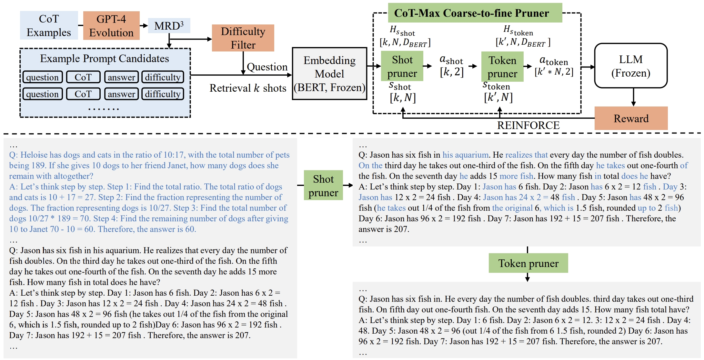

# CoT-Influx
This repository contains the code of CoT-Influx introduced in our work: "[Fewer is More: Boosting LLM Reasoning with Reinforced Context Pruning](https://arxiv.org/abs/2312.08901)", published in EMNLP Main Conference 2024.

<div align=center>

</div>

## 🌟 Abstract

Motivated by the observation that adding more concise CoT examples in the prompt can improve LLM reasoning performance, we propose **CoT-Influx**, which employs a coarse-to-fine pruner to maximize the input of effective and concise CoT examples. The pruner first selects as many crucial CoT examples as possible and then prunes unimportant tokens to fit the context window. 

- CoT-Influx significantly outperforms various prompting baselines across various LLMs (LLaMA2-7B, 13B, 70B) and 5 math datasets, achieving up to 4.55% absolute improvements. 
- Without any fine-tuning, LLaMA2-70B with CoT-Influx surpasses GPT-3.5 and a wide range of larger LLMs (PaLM, Minerva 540B, etc.) on the GSM8K.

## 🌿 Citation

    @article{huang2023fewer,
        title={Fewer is More: Boosting LLM Reasoning with Reinforced Context Pruning},
        author={Huang, Xijie and Zhang, Li Lyna and Cheng, Kwang-Ting and Yang, Mao},
        journal={arXiv preprint arXiv:2312.08901},
        year={2023}
    }

## 🛠️ Preparation

### Requirements
```shell
pip install -r requirements.txt
```

### Huggingface Hub Login

```bash
pip install --upgrade huggingface_hub
huggingface-cli login
```

### Preparing for pruner training data and prompt candidates for evaluation

- Our pruner weights are provided in `./pruner_ckpt/*`
    - `llama2_13b.pth`, which are trained using the loss and response of LLaMA2-13B, target token `T=2048`, token penalty `w=(-1,1)`, selection repeat `t_{repeat}=10`, with easy-only filter on dataset. The pruner is used for the evaluation of LLaMA2-7B and LLaMA2-13B model.
    - `llama2_70b.pth`, which are trained using the loss and response of LLaMA2-70B, target token `T=2048`, token penalty `w=(-1,1)`, selection repeat `t_{repeat}=5`. The pruner used for the evaluation of LLaMA2-70B model.
- Check our prompt evolution scripts for MRD^3 in `./mrd3/*`

## 🏃 Run

### Pruner training on MRD$^3$

- To be released soon

### Evaluation on math reasoning dataset
To evaluate the few-shot reasoning performance of LLaMA2-7B with CoT-Influx on GSM8K, run the following command
```
CUDA_VISIBLE_DEVICES=0 python example_retrieval_pruner.py \
--base_model meta-llama/Llama-2-7b-hf \
--pruner_model ./pruner_ckpt/llama2_13b.pth \
--candidate_set ./mrd3/score_revise_difficulty_mrd3.json \
--method few_shot_cot --cot_shot_length 32 --add_16shot \
2>&1 | tee -a ./logs/llama2-7b-gsm8k.log
```

To evaluate LLaMA2-13B with CoT-Influx on GSM8K, run the following command
```
CUDA_VISIBLE_DEVICES=0 python example_retrieval_pruner.py \
--base_model meta-llama/Llama-2-13b-hf \
--pruner_model ./pruner_ckpt/llama2_13b.pth \
--candidate_set ./mrd3/score_increase_reasoning_mrd3.json \
--method few_shot_cot --cot_shot_length 24 --add_16shot \
2>&1 | tee -a ./logs/llama2-13b-gsm8k.log
```

To evaluate LLaMA2-13B with CoT-Influx on GSM8K, run the following command
```
CUDA_VISIBLE_DEVICES=0 python example_retrieval_pruner.py \
--base_model meta-llama/Llama-2-70b-hf \
--pruner_model ./pruner_ckpt/llama2_70b.pth \
--candidate_set ./mrd3/score_add_constraints_mrd3.json \
--method few_shot_cot --cot_shot_length 32 --add_8shot \
2>&1 | tee -a ./logs/llama2-70b-gsm8k.log
```

## 📚 Results and Logs

| Model    | EM (\%) on GSM8K | Pruner weights  | Evaluation logs |
|:-------:|:--------:|:--------:|:--------:|
| `LLaMA2-7B`  | **15.85**  | `llama2_13b.pth` |  [link](./logs/llama2-7b-best_eval-score_revise_difficulty_32shot_add16shot.log) |
| `LLaMA2-13B` | **32.22**  | `llama2_13b.pth` |  [link](./logs/llama2-13b-best_eval-score_increase_reasoning_24shot_add16shot.log) |
| `LLaMA2-70B` | **59.59**  | `llama2_70b.pth` |  [link](./logs/llama2-70b-best_eval-add_constraints_32shot_add8shot.log) |

## 💌 Acknowledgement and Contact

This repo benefits from [zero_shot_cot](https://github.com/kojima-takeshi188/zero_shot_cot), [WizardLM](https://github.com/nlpxucan/WizardLM), [LLM-Adapters](https://github.com/AGI-Edgerunners/LLM-Adapters), and [OpenICL](https://github.com/Shark-NLP/OpenICL). Thanks for their wonderful works!

If you have any questions, feel free to contact Xijie HUANG (huangxijie1108 at gmail.com or xhuangbs at connect.ust.hk) and Li Lyna Zhang (lzhani at microsoft.com).